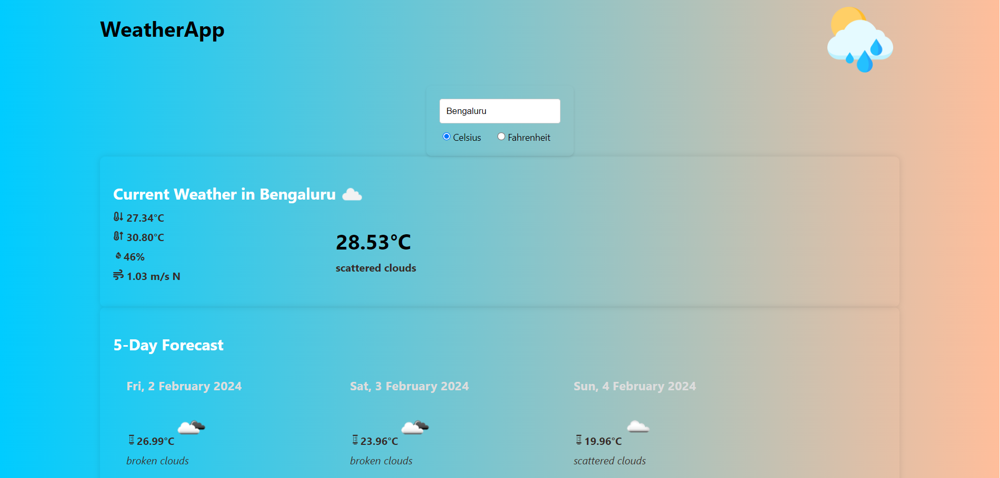

# Weather App

## Overview

The Weather App is a web application that provides current weather information and a 5-day forecast for a given city. Users can enter the city name and choose between Celsius and Fahrenheit units to view weather details.

## Features

- **Current Weather:** Get real-time information about the current weather, including temperature, humidity, wind speed, and description.

- **5-Day Forecast:** View a 5-day forecast with details like date, average temperature, and weather description.

## Screenshot



## Technologies Used

- React: A JavaScript library for building user interfaces. 

- Axios: A promise-based HTTP client for making API requests. 

- OpenWeatherMap API: Used for fetching weather data. [Check the documentation here](https://openweathermap.org/api).

- React Icons: A library for including popular icons in React projects. [Check the documentation here](https://react-icons.github.io/react-icons/).


## Setup

1. Clone the repository:

   ```bash
   git clone https://github.com/amanyddv/weather_app.git
   
2. Install dependencies:
   ```bash
   cd weather_app
   npm install
   
3. Run the application:
   ```bash
   npm start
   
## Usage

1. Enter the city name in the input field.
2. Choose between Celsius and Fahrenheit for temperature units.


